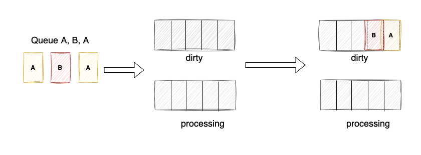
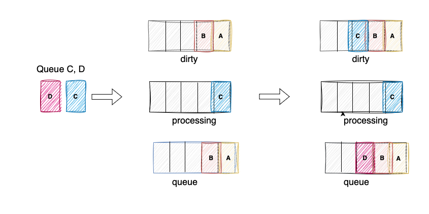
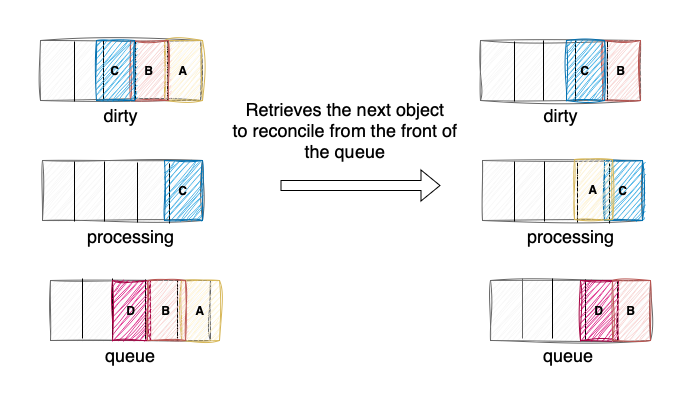

# Concurrent Reconciling

When setting up a Kubernetes controller, we have seen that controller supports concurrent reconciliations.

The _MaxConcurrentReconciles_ setting determines the maximum number of concurrent reconciliation processes that can be run at the same time. In other words, it controls how many different instances can be handled for reconciliation in parallel.

```go
func (r *CleanerReconciler) SetupWithManager(ctx context.Context, mgr ctrl.Manager,
	numOfWorker int, logger logr.Logger) error {

	return ctrl.NewControllerManagedBy(mgr).
		For(&appsv1alpha1.Cleaner{}).
		WithOptions(controller.Options{
			MaxConcurrentReconciles: r.ConcurrentReconciles,
		}).
		Complete(r)
}
```

Imagine a Kubernetes controller responsible for managing a large number of resources. When these resources change frequently, a backlog of reconcile requests can build up. This can lead to delays in ensuring the desired state of your cluster.

Here's where concurrent reconciliation comes in. By running multiple reconcile loops simultaneously, the controller can process these requests much faster.

Now, the million-dollar question: can multiple reconcile loops work on the same resource at the same time? The answer is no. This is guaranteed by [client-go](https://github.com/kubernetes/client-go/blob/a57d0056dbf1d48baaf3cee876c123bea745591f/util/workqueue/queue.go#L65). Quoting from the documentation:

```go
//  * Stingy: a single item will not be processed multiple times concurrently,
//      and if an item is added multiple times before it can be processed, it
//      will only be processed once.
//  * Multiple consumers and producers. In particular, it is allowed for an
//      item to be reenqueued while it is being processed.
```

## Workqueue Implementation

The workqueue uses a `queue` and two sets: `dirty` and `processing`.

```go
// Type is a work queue (see the package comment).
type Type struct {
	// queue defines the order in which we will work on items. Every
	// element of queue should be in the dirty set and not in the
	// processing set.
	queue []t

	// dirty defines all of the items that need to be processed.
	dirty set

	// Things that are currently being processed are in the processing set.
	// These things may be simultaneously in the dirty set. When we finish
	// processing something and remove it from this set, we'll check if
	// it's in the dirty set, and if so, add it to the queue.
	processing set
```

The `dirty` set plays a crucial role in deduplication. When a resource needs reconciliation, it's checked against the `dirty` set. If the resource (like our example resource A) is already present, it's not added again, even if it undergoes further changes in a short timeframe. This prevents redundant processing of the same resource for multiple, quick updates.

This deduplication capability is a core aspect of concurrent reconciliation. It ensures the controller focuses on the actual cluster state, obtained from the apiserver or local cache, rather than reacting to every individual event update. This streamlines the process and avoids unnecessary work.

<p align="center">
  
</p>

The `processing` set plays a vital role in preventing same resource being reconciled multiple times concurrently. After being added to the `dirty` set, a resource is only added to the `queue` if it's not already present in the `processing` set. The `processing` set essentially tracks resources that are currently undergoing reconciliation.

Consider this scenario: Imagine a resource named _C_ changes. If _C_ is already in the `processing` set (meaning it's being reconciled), it won't be added to the `queue` again. This avoids the controller from starting multiple reconciliations for the same resource simultaneously.

On the other hand, if a resource like _D_ changes and isn't currently processing, it gets added to both the `dirty` set and the `queue`. This ensures _D_ gets picked up for reconciliation when a reconcile loop becomes available.

<p align="center">
  
</p>

When the reconciliation process is ready for a new task, it grabs the first one in line from the `queue`. This item is then marked as being worked on by adding it to the `processing` set. Finally, it's removed from the `dirty` set, indicating it's no longer waiting for reconciliation.

<p align="center">
  
</p>

In above example, _A_ is picked to be reconciled. _A_ is added to the `processing` set and removed from the `dirty` set.

## Conclusion

Concurrent reconciliation is a powerful feature in Kubernetes controllers that can significantly improve performance when managing a large number of frequently changing resources. By running multiple reconcile loops concurrently, the controller can process updates much faster and ensure your deployments reach their desired state more quickly.

This approach avoids the potential delays caused by a single reconcile queue, but it also implements safeguards to prevent conflicts. The workqueue guarantees that resources are not processed simultaneously, ensuring data consistency and preventing race conditions.
