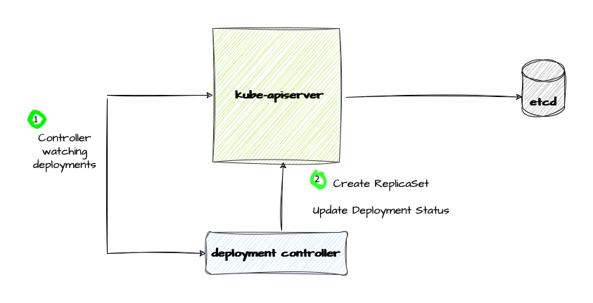

# Kubernetes APIs

Kubernetes provides a robust API for managing your cluster. API uses a RESTful design, allowing to perform common actions like creating, retrieving, 
updating, deleting, listing, patching, and watching various resources within your cluster,

Kubernetes APIs are divided into groups:

1. **core** group: this includes _Nodes_, _Pods_, _Namespaces_, _Services_, _ConfigMaps_ and _Secrets_. 
2. **named** groups: These groups categorize related functionalities. For example, the ```apps``` group contains resources for managing _deployments_, 
_stateful sets_, _daemon sets_, and _replica sets_, while the ```batch``` group handles _jobs_ and _cron jobs_.

Each group may have one or more versions that evolve independent of other API groups, and each version within the group has one or more resources. 

<p align="center">
  
</p>
 
To summarize:

1. **Group**: Categorizes resources based on functionality or origin. This allows for easy API extension by adding new groups for specific features.

2. **Version**: Represent specific API versions within a group. New features or modifications to existing resources might be introduced in different versions. Versioning ensures compatibility and smoother upgrades.

3. **Resource** type is the name used in the URL (e.g., pods, namespaces, services).

4. **Kind**: defines the concrete representation (object schema) of a resource type.

5. **Collection**: refers to a list of instances for a specific resource type. There are distinct collection kinds with "List" appended (e.g., _PodList_, _ServiceList_).

6. **Resource**: an individual instance of a resource type, typically representing an object in your cluster.

7. **Sub-resources:**: for specific resource types, additional functionalities are exposed as sub-resources within the resource URI path.

To see all the available API resources in your cluster: ```kubectl api-resources```

```
NAME                                SHORTNAMES   APIVERSION                                NAMESPACED   KIND
bindings                                         v1                                        true         Binding
configmaps                          cm           v1                                        true         ConfigMap
endpoints                           ep           v1                                        true         Endpoints
events                              ev           v1                                        true         Event
limitranges                         limits       v1                                        true         LimitRange
namespaces                          ns           v1                                        false        Namespace
nodes                               no           v1                                        false        Node
persistentvolumeclaims              pvc          v1                                        true         PersistentVolumeClaim
persistentvolumes                   pv           v1                                        false        PersistentVolume
pods                                po           v1                                        true         Pod
...
```

The API server handles all requests. 

<p align="center">
  
</p>


When we create a deployment for instance, the kube-apiserver validates the content of our deployment to ensure it meets the required format and follows the rules. Once validated, it stores the deployment information in the cluster's data store, typically etcd.

<p align="center">
  
</p>

Much of the behavior of Kubernetes is implemented by programs called controllers, that are clients of the API server. 
Kubernetes comes already with a set of built-in controllers. For instance we can look at the `kube-controller-manager` pod's log to see which controllers are started. The _deployment controller_ is one of those.

```
kubectl logs -n kube-system                         kube-controller-manager-sveltos-management-control-plane 
...
I0531 15:34:16.026590       1 controllermanager.go:759] "Started controller" controller="deployment-controller"
```

The deployment controller is constantly watching for deployment instances. In our case, when we created a new deployment, the deployment controller became aware of this change and it took action to achieve the desired state we specified. In this case, it created a ReplicaSet resource. The deployment controller also updated the deployment status section. This section keeps track of the progress towards achieving the desired state. 

# Objects

Every object must have the following data. 

`TypeMeta` contains the kind and API version.

A nested field `metadata` contains:

1. **namespace**: the default namespace is 'default'. Cluster wide resources do not have this field set.
2. **name**: a string that uniquely identifies this object within the current namespace. This value is used in the path when retrieving an individual object.
3. **uid**: a unique in time and space value used to distinguish between objects with the same name that have been deleted and recreated.
4. **resourceVersion**: a string that identifies the internal version of this object that can be used by clients to determine when objects have changed;
5. **creationTimestamp**: a string representing the date and time an object was created.
6. **deletionTimestamp**: a string representing the date and time after which this resource will be deleted.
7. **labels**: a map of string keys and values that can be used to organize and categorize objects.
8. **annotations**: a map of string keys and values that can be used by external tooling to store and retrieve arbitrary metadata about this object.

<p align="center">
  
</p>

A nested object field called `spec` represents the desired state of an object. 

A nested object field called `status` summarizes the current state of the object in the system. The Kubernetes declarative API enforces a separation of responsibilities. You declare the desired state of your resource (spec). The Kubernetes controller keeps the current state of Kubernetes objects in sync with your declared desired state.

When covering [reconcilers](../docs/reconciler.md) we will cover:

- how Kubernetes uses resourceVersion to detect conflicts when updating a resource;

- why deletionTimestamp, along with finalizers, is important;

- how to use labels to query a group of related objects (for instance all Pods backing up a Service);

- how to provide different authorizations for Spec and Status and how reconcilers work.

# Extending the Kubernetes API

Any system that is successful needs to grow and change as new use cases emerge or existing ones change. Therefore, Kubernetes has designed the Kubernetes API to continuously change and grow. There are two ways to extend Kubernetes APIs:

- The `CustomResourceDefinition` (CRD) mechanism allows you to declaratively define a new custom API with an API group, kind, and schema that you specify. CRDs allow you to create new types of resources for your cluster without writing and running a custom API server. 
When you create a new CustomResourceDefinition, the Kubernetes API Server creates a new RESTful resource path for each version specified. 

- The `aggregation layer` sits behind the primary API server, which acts as a proxy. This arrangement is called API Aggregation (AA), which allows you to provide specialized implementations for your custom resources by writing and deploying your own API server. 
The main API server delegates requests to your API server for the custom APIs that you specify.


<p align="center">
  
</p>

You can register an `extension API server` by creating an _APIService_ claiming a URL path in the Kubernetes API. From that point on, `kube-aggregator` will forward  any request sent to that API path will be forwarded to the registered APIService.

Most of the time you are fine with adding a new CustomResourceDefinition. Unless you need custom validations and already have a program that serves your API and works well, you can go with CRD. This tutorial will delve into the process of creating CustomResourceDefinitions.

# CustomResourceDefinition

To introduce new resources, you can use CustomResourceDefinitions.
CRDs extends Kubernetes capabilities by allowing users to create new types of resources beyond the built-in set.

A CustomResourceDefinition is a Kubernetes resource itself. So you can create a CustomResourceDefinition like you would create any other Kubernetes resources.

Most validation can be specified in the CRD using OpenAPI v3.0 validation and the Common Expression Language. Any other validations is supported by addition of a Validating Webhook.

In this section, we’ll dive deep into the creation and management of Custom Resource Definitions in Kubernetes. 

# Kubebuilder

[Kubebuilder](https://github.com/kubernetes-sigs/kubebuilder), a framework by Kubernetes SIGs, simplifies creating Kubernetes APIs using Custom Resource Definitions.

With Kubebuilder installed, you can create a new project. Those were the steps for me:

```
brew install kubebuilder
mkdir my-project
kubebuilder init --domain projectsveltos.io
kubebuilder create api --group app --version v1alpha1 --kind MyKind[^2]
```

- **Group**: This acts as a unique identifier for your set of custom resources. It's recommended to use a subdomain you control (e.g., yourcompany.com) to prevent conflicts with existing Kubernetes groups.
- **Version**: Kubernetes versions follow a specific format: vX.Y (optionally with alpha or beta) and potentially additional numbers. alpha indicates a feature under development, while beta suggests more stability.
- **Kind**: This defines the specific type of resource within your API (e.g., Database, ConfigMap). It essentially names the individual resources you'll be managing.

Kubebuilder utilizes a tool called [controller-gen](https://book.kubebuilder.io/reference/controller-gen) to automate the creation of essential code and configuration files. 
This automation hinges on special comments embedded within your Go code, known as ```marker comments```.

Above instructions created


In Kubebuilder projects, two key files play specific roles:

- **groupversion_info.go**: This file, as its name suggests, holds information about the API group and version for your CRD. It typically defines a variable named GroupVersion with the group (e.g., app.projectsveltos.io) and version (e.g., v1alpha1). This establishes the unique identifier for your CRD within the Kubernetes API.
- **mykind_types.go**: This file is where you define the actual resource itself. It contains the structure of your CRD, including its fields and any validation rules. This file essentially describes the data your CRD will manage within your Kubernetes cluster.

```go
	GroupVersion = schema.GroupVersion{Group: "app.projectsveltos.io", Version: "v1alpha1"}
```

while mykind_types.go is where our resource is defined.


```go
package v1alpha1

import (
	metav1 "k8s.io/apimachinery/pkg/apis/meta/v1"
)

// EDIT THIS FILE!  THIS IS SCAFFOLDING FOR YOU TO OWN!
// NOTE: json tags are required.  Any new fields you add must have json tags for the fields to be serialized.

// MyKindSpec defines the desired state of MyKind
type MyKindSpec struct {
	// INSERT ADDITIONAL SPEC FIELDS - desired state of cluster
	// Important: Run "make" to regenerate code after modifying this file

	// Foo is an example field of MyKind. Edit mykind_types.go to remove/update
	Foo string `json:"foo,omitempty"`
}

// MyKindStatus defines the observed state of MyKind
type MyKindStatus struct {
	// INSERT ADDITIONAL STATUS FIELD - define observed state of cluster
	// Important: Run "make" to regenerate code after modifying this file
}

// +kubebuilder:object:root=true
// +kubebuilder:subresource:status

// MyKind is the Schema for the mykinds API
type MyKind struct {
	metav1.TypeMeta   `json:",inline"`
	metav1.ObjectMeta `json:"metadata,omitempty"`

	Spec   MyKindSpec   `json:"spec,omitempty"`
	Status MyKindStatus `json:"status,omitempty"`
}

...
```

Now, you are ready to customize the API behavior by defining the __MyKindSpec__ and __MyKindStatus__ structs in mykind_types.go. 
Once you've completed these definitions, running ```make manifests``` will generate the CustomResourceDefinition file in _config/crd/bases/app.projectsveltos.io_mykinds.yaml_.

I'll use concrete examples from open-source projects to illustrate the concepts (and the markers) we discussed.

But first, there's a key requirement for working with Custom Resources in Golang. The client-go library, used to interact with the Kubernetes API, requires resources (including Custom Resources) to implement the ```runtime.Object``` interface. 
This interface ensures objects can be serialized and deserialized for communication with the API server. One crucial aspect of the runtime.Object interface is the need for DeepCopy methods. These methods create a complete copy of the object.
By including the ```// +kubebuilder:object:root=true``` marker in your code, you instruct Kubebuilder to automatically generate the necessary methods (including DeepCopy) for implementing the runtime.Object interface.


# Example: Cleaner CRD

When I developed [k8s-cleaner](https://github.com/gianlucam76/k8s-cleaner) the goal was to create a tool that could identify unused or unhealthy resources across the cluster. This tool could then either remove or update those resources as needed.

## Choosing the Scope
A key design decision involved the scope. Since the primary users are platform administrators who manage the entire cluster, I opted for a __cluster-wide__ scope. This allows admins to identify unused resources (e.g., ConfigMaps) across all namespaces efficiently. This eliminates the need to deploy separate cleaners for each namespace, streamlining their workflow.

However, while a cluster-wide scope offers clear benefits for platform admins, I also acknowledged the potential need for users to focus on specific namespaces. To address this flexibility, I incorporated namespace filtering as a configuration option. This allows users to customize the cleaner's operation to their specific requirements. As a configuration option, it's exposed within the __Spec__ field.

The marker comment used to define a cluster-wide scope for the Cleaner controller is:

```yaml
//+kubebuilder:resource:path=cleaners,scope=Cluster
```

If you decide your resources should be scoped to namespace:

```yaml
//+kubebuilder:resource:path=cleaners,scope=Namespaced
```

## Spec 

The Spec represents the desired state, including user-defined settings and system defaults. So expose in the Spec all that the user might need to specify.

My vision was to empower users with the ability to:

1. *Define Criteria*: Clearly specify what constitutes an unused or unhealthy resource in their specific context.
2. *Schedule Scans*: Determine how often the Cleaner controller should scan the cluster for resources meeting your cleanup criteria.
3. *Automate Actions*: Choose the desired action (removal or update) to be taken on identified resources.

Remember some fields might be optional and have a default value. Use the ```// +kubebuilder:default:=``` marker to specify the default value.

```yaml
// +kubebuilder:default:=Delete
Action Action `json:"action,omitempty"`
```

Here, `Delete` is the default action if not explicitly defined by the user.

Add the ```optional``` marker along to the json struct ```omitempty``` tag of the field you want to make optional.

```yaml
// +optional
Transform string `json:"transform,omitempty"`
```

Full list of [validation markers](https://book.kubebuilder.io/reference/markers/crd-validation.html?highlight=%2F%2F%20%2Bkubebuilder%3Avalidation%3AEnum#crd-validation).

## Status Subresource

The status subresource is enabled via ```//+kubebuilder:subresource:status```.  This subresource exposes an additional endpoint specifically for the status of your cleaner instance.

In Kubernetes, as already explained, a `resource` represents a logical entity like a Pod or a Deployment. Each resource has an associated API endpoint. The status subresource provides a dedicated endpoint for monitoring the current state and progress of your cleaner instance.

It's important to note that updates made to the main cleaner resource won't directly affect its status. Likewise, changes to the status subresource only influence the status information, not the main configuration. This separation allows for focused updates.

Since the status subresource has its own endpoint, you can leverage RBAC (Role-Based Access Control) to manage access to the cleaner resource and its status independently. This enables you to define who can view or modify the cleaner's configuration and who can monitor its progress through the status subresource.

<p align="center">
  
</p>


Understanding who defines the Spec and who utilizes the Status is crucial when designing a CRD. These sections play distinct roles in managing your Cleaner resource.

The Spec section acts as a blueprint for the desired state of your Cleaner resource. In this scenario, the platform administrator defines the Spec by outlining the cleaning criteria, scan schedule, and desired actions. 
Essentially, the Spec tells the Cleaner controller what to do.

The Status section, automatically updated by the Cleaner controller, reflects the current state of your resource. It provides valuable information for the platform administrator, such as:

1. _lastRunTime_: The timestamp of the most recent Cleaner execution.
2. _failureMessage_ (optional): A human-readable error message if the last run failed.
3. _nextScheduleTime_: The scheduled time for the next Cleaner execution.

By monitoring the Status subresource, the platform administrator gains insights into the Cleaner's performance and can identify any potential cleaning errors.

## Make generate

Once done defining Spec and Status, just run ```make generate``` target. That will simply properly invoke controller-gen behind the scene.

This will generate the [Cleaner CustomResourceDefinition](https://github.com/gianlucam76/k8s-cleaner/blob/main/config/crd/bases/apps.projectsveltos.io_cleaners.yaml). Use _kubectl_ to apply it to your cluster.

## Apiextension-apiserver

After posting a CustomResourceDefinition object, the `apiextensions-apiserver` inside of kube-apiserver will check whether there is a conflict and whether the resource is valid. It will then report the result in the status of the CRD, for example:

```
kubectl get customresourcedefinitions cleaners.apps.projectsveltos.io -o yaml
```

```yaml
apiVersion: apiextensions.k8s.io/v1
kind: CustomResourceDefinition
metadata:
  name: cleaners.apps.projectsveltos.io
...
status:
  acceptedNames:
    kind: Cleaner
    listKind: CleanerList
    plural: cleaners
    singular: cleaner
  conditions:
  - lastTransitionTime: "2024-05-31T12:32:39Z"
    message: no conflicts found
    reason: NoConflicts
    status: "True"
    type: NamesAccepted
  - lastTransitionTime: "2024-05-31T12:32:39Z"
    message: the initial names have been accepted
    reason: InitialNamesAccepted
    status: "True"
    type: Established
  storedVersions:
  - v1alpha1
```

##  Common Expression Language (CEL)

For ensuring your CRD configurations are well-defined, you can leverage marker comments with `Common Expression Language` (`CEL`). Since Kubernetes v1.25 introduced CEL support for validation in beta, you can now write expressions to validate your custom resources.


Marker ```//+kubebuilder:validation:XValidation:rule```  can be used for this scope.

### Immutability

One common example is immutability.  For instance if I wanted to make Cleaner.Spec.Schedule string immutable

```yaml
//+kubebuilder:validation:XValidation:rule="self == oldSelf",message="Value is immutable"
Schedule string `json:"schedule"`
```

With that, If I tried to update a Cleaner instance changing the _schedule_ field, the update would fail

```
The Cleaner "list-pods-with-outdated-secret-data" is invalid: spec.schedule: Invalid value: "string": Value is immutable
```

self is a special keyword in CEL which refers to the object whose type contains the rule. In the above example, self refers to Schedule field. So I am only forcing the Schedule field to be immutable.

### Append-only list

Another common example is a list which is append only. As a hypothetical example, if ResourceSelectors were designed this way


```yaml
//+kubebuilder:validation:XValidation:rule="size(self) >= size(oldSelf)",message="this list is append only"
ResourceSelectors []ResourceSelector `json:"resourceSelectors"`
```

any update reducing that list would fail

```
The Cleaner "list-pods-with-outdated-secret-data" is invalid: spec.resourcePolicySet.resourceSelectors: Invalid value: "array": this list is append only
```

### Name format

To enforce that cleaner instance starts with "my-prefix" (remember the meaning of _self_ )

```yaml
// Cleaner is the Schema for the cleaners API
type Cleaner struct { //+kubebuilder:validation:XValidation:rule=self.metadata.name.startsWith("my-prefix")
```

creating any Cleaner instance with an incorre name will fail

```
The Cleaner "list-pods-with-outdated-secret-data-2" is invalid: <nil>: Invalid value: "object": failed rule: self.metadata.name.startsWith("my-prefix")
```

When dealing with string fields in your CRD, you can leverage the ```+kubebuilder:validation:Pattern``` annotation to enforce a specific format using regular expressions.
For example, to ensure a string field named description starts with a letter or underscore and only contains letters, numbers, and underscores, you can use the following YAML snippet:

```yaml
// +kubebuilder:validation:Pattern=`^[A-Za-z_][A-Za-z0-9_]*$`
Description string `json:"description"`
```

If you have a string field that requires a valid date and time format, typically following RFC 3339, you can use the ```+kubebuilder:validation:Format="date-time"``` annotation.
For instance, to validate a field named TimeOfX, the following YAML snippet would ensure it adheres to RFC 3339:

```yaml
//+kubebuilder:validation:Format="date-time"
TimeOfX string `json:"timeOfX"`
```

then _"2024-06-03T15:29:48Z"_ would be a valid value, while "2024" would not be.

### Comparing different fields

Imagine having a Spec with

```yaml
// +kubebuilder:validation:XValidation:rule=self.minReplicas <= self.replicas
type MyResourceSpec struct {
  Replicas int `json:"replicas"`

  MinReplicas int `json:"minReplicas"`
```

above marker enforces that minReplicas is always less than or equal to replicas.

# Example: ClusterProfile CRD

I also maintain another open-source project called [addon-controller](https://github.com/projectsveltos/addon-controller). 
It's a Kubernetes controller that simplifies managing add-ons and applications across multiple clusters. It operates from a central management cluster, managing add-ons and applications on the managed clusters it oversees.

Sveltos introduces two custom resource definitions: [ClusterProfile](https://github.com/projectsveltos/addon-controller/blob/7f7677fa9454b83c50215feed745365bad63c99a/api/v1alpha1/clusterprofile_types.go#L36) and [Profile](https://github.com/projectsveltos/addon-controller/blob/7f7677fa9454b83c50215feed745365bad63c99a/api/v1alpha1/profile_types.go#L36). Both these CRDs empower users to:

1. select a subset of managed cluster using a cluster selector.
2. list the add-ons an applications that must be deployed on those clusters. 

They have distinct scopes though to cater to different user roles:

- `ClusterProfiles`: Cluster wide resource. It applies across all clusters in any namespace. Ideal for platform admins maintaining global consistency and managing settings like networking, security, and resource allocation.
- `Profiles`: Limited to a specific namespace, granting granular control to tenant admins. This isolation ensures teams manage, from the management cluster, their managed clusters independently without impacting others.

What goes in the Spec is well defined. Let's explore some of the Spec field's markers.

```yaml
// HelmChartAction specifies action on an helm chart
// +kubebuilder:validation:Enum:=Install;Uninstall
type HelmChartAction string
```

This specifies that this (scalar) field is restricted to the *exact* values specified here, _Install_ and _Uninstall_.
If I try to post a ClusterProfile with incorrect value for this field, the post will fail

```
The ClusterProfile "deploy-kyverno" is invalid: spec.helmCharts[0].helmChartAction: Unsupported value: "Deploy": supported values: "Install", "Uninstall"
```

```yaml
// RepositoryURL is the URL helm chart repository
// +kubebuilder:validation:MinLength=1
RepositoryURL string `json:"repositoryURL"`
```

This specifies the minimum length for this string. If I try to post a ClusterProfile leaving this field empty , the post will fail

```
The ClusterProfile "deploy-kyverno" is invalid: spec.helmCharts[0].repositoryURL: Invalid value: "": spec.helmCharts[0].repositoryURL in body should be at least 1 chars long
```

Different markers can be used together

```yaml
// +kubebuilder:default:=100
// +kubebuilder:validation:Minimum=1
// +optional
Tier int32 `json:"tier,omitempty"`
```

A common challenge involves ensuring no duplicates exist within a list. In the context of add-on controllers, this becomes relevant when fetching resources from the management cluster for templating purposes. 
Each fetched resource is identified by a unique key field called an __identifier__. This identifier acts similarly to a dictionary key, enabling the creation of an associative structure where each resource is uniquely accessible.

```yaml
// +listType=map
// +listMapKey=identifier
// +optional
TemplateResourceRefs []TemplateResourceRef `json:"templateResourceRefs,omitempty" patchStrategy:"merge" patchMergeKey:"identifier"`
```

- listType=map: This annotation specifies that `TemplateResourceRefs` is a list treated as a map.
- listMapKey=identifier: This annotation defines the key field within each list item used for mapping (the identifier).

Following this definition, the TemplateResourceRef struct details the structure of each item within the TemplateResourceRefs list:

```yaml
type TemplateResourceRef struct {
  // Resource references a Kubernetes instance in the management
  // cluster to fetch and use during template instantiation.
  Resource corev1.ObjectReference `json:"resource"`

  // Identifier is how the resource will be referred to in the
  // template
  Identifier string `json:"identifier"`
}
```

When defining resources for templating within TemplateResourceRefs, each resource must have a unique identifier. Attempting to create a profile instance that uses an identifier already assigned to another resource in TemplateResourceRefs will result in rejection.

For improved user experience, the profile status should primarily focus on displaying a list of managed clusters matching a specific profile. This provides a clear view of which clusters the profile targets. As we'll delve deeper into the reconciler section, the profile controller's role becomes clear: monitoring managed clusters and identifying potential matches for profiles.

<p align="center">
  
</p>

It's important to remember the principle of single ownership for resources, including the profile status. Storing deployment error information directly in the profile status might suggest that the profile controller itself is responsible for deploying resources on managed clusters. However, this would overload the profile controller, especially if a profile potentially matches dozens of clusters. For efficient management, deployment responsibilities should be handled separately. Therefore, the profile controller focuses on its core function: watching for clusters and maintaining a list of matching managed clusters. This list is reflected in the profile status, providing clear visibility.

For each managed cluster matching a profile instance, profile controller creates a ClusterSummary instance.

A separate controller, the ClusterSummary controller, takes over the responsibility of deploying add-ons and applications based on the information in the ClusterSummary. 
The ClusterSummary resource maintains a "Status" section that reflects the deployment progress. This section keeps you informed about whether the add-ons and applications have been successfully deployed to the cluster or any errors that might have occurred during the deployment process.

# Additional Printer Columns

We saw previously that users can interact with custom resources using kubectl similar to built-in resources. The ```+kubebuilder:printcolumn``` marker allows you to define additional information displayed by kubectl get.

Sveltos supports registering various clusters (GKE, Civo, etc.) with it. Once a cluster is registered, Sveltos can deploy add-ons and applications on it. 
The SveltosCluster CRD (defined in [SveltosCluster](https://github.com/projectsveltos/libsveltos/blob/main/api/v1alpha1/sveltoscluster_type.go)) enables cluster registration with Sveltos.

When listing or getting existing SveltosCluster resources, it's helpful to see the managed cluster's readiness and Kubernetes version at a glance. Here's how to achieve that:

```yaml
//+kubebuilder:printcolumn:name="Ready",type="boolean",JSONPath=".status.ready",description="Indicates whether cluster is ready to be managed by sveltos"
//+kubebuilder:printcolumn:name="Version",type="string",JSONPath=".status.version",description="Kubernetes version associated with this Cluster"
```

```
kubectl get sveltoscluster -A
NAMESPACE   NAME   READY   VERSION
mgmt        mgmt   true    v1.29.1
```

## Validation ratcheting

What if you want to add a new validation to a CRD you have already introduced and shipped? Existing custom objects might conflict with the new validation, so you'll need a plan to address them. As alwasy, Kubernetes comes to help.

Provided you enabled the feature gate, Kubernetes implements validation racheting for CustomResourceDefinitions. The API server is willing to accept updates to resources that are not valid after the update, provided that each part of the resource that failed to validate was not changed by the update operation. In other words, any invalid part of the resource that remains invalid must have already been wrong. You cannot use this mechanism to update a valid resource so that it becomes invalid.

This feature allows authors of CRDs to confidently add new validations to the OpenAPIV3 schema under certain conditions. Users can update to the new schema safely without bumping the version of the object or breaking workflows.

# Delete a CustomResourceDefinition

When you delete a CustomResourceDefinition, the server will uninstall the RESTful API endpoint and delete all custom objects stored in it.
If you later recreate the same CustomResourceDefinition, it will start out empty.

# Conclusion

Please note that on their own, custom resources let you store and retrieve structured data. If you only need to store data, defining a CRD is all that you need. Then using a REST client, you can create objects or query existing objects of the Kind you introduced.

When you combine a custom resource with a custom controller, that you are adding new functionatilies. 

Also note, not all controllers need to define a new custom resource. For instance https://github.com/gianlucam76/claudie-sveltos-integration is a controller that watches for Kubernetes Secrets created by Claudie and creates a corresponding SveltosCluster resource so that Sveltos can automatically discover clusters created by Claudie. 


[^1]:A Kind is unique within a group. For instance _Service_ is the kind in the _core_ group and the Knative _serving.knative.dev_ group. 
[^2]:Since we are interested in creating a CustomResourceDefinition for now, answer yes to _Create Resource [y/n]_ and no to _Create Controller [y/n]_