# Kubernetes Controller

Behind the scenes in Kubernetes, controllers constantly monitor the cluster's state, comparing it to your desired configuration. Whenever there's a gap between the two, they spring into action.

<p align="center">
  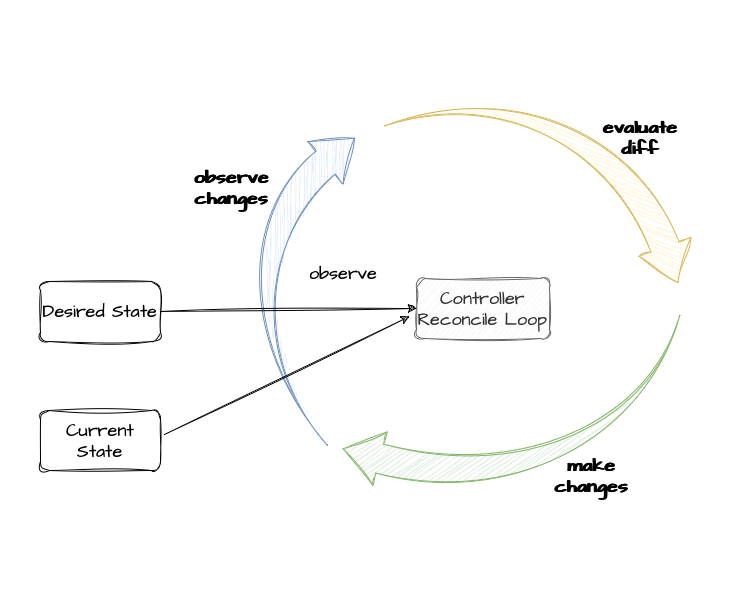
</p>

Each controller focuses on a specific type of resource in Kubernetes, like pods or deployments. Remember how we talked about resources having a ["spec"](custom-resources.md#objects) field? This spec defines your desired state for that resource. The controller's job is to make the actual state (what's currently running) match that spec.

In other words, the controller makes adjustments to bring things in line with your desired state. It then updates the status with the latest information. Other controllers might potentially take their own actions based on the new information.

Let's what happens behind the scene when we create a deployment:

1. Imagine you have a file named deployment.yaml that contains instructions for your deployment (like the one shown below). This file describes how many Nginx pods you want to run and their configuration. To deploy your application based on this configuration, you can run the following command:
`kubectl apply -f deployment.yaml -n test`

```yaml
apiVersion: apps/v1
kind: Deployment
metadata:
  name: nginx-deployment
spec:
  replicas: 2
  selector:
    matchLabels:
      app: nginx
  template:
    metadata:
      labels:
        app: nginx
    spec:
      containers:
      - name: nginx
        image: nginx:latest
        ports:
        - containerPort: 80
```

2. Behind the scenes, Kubernetes has a special a [Deployment controller](https://github.com/kubernetes/kubernetes/blob/e67f889edc4ab278028f6cffd2501bc90a0defcf/pkg/controller/deployment/deployment_controller.go#L101). This controller constantly monitors the cluster for deployments instances. When it detects the newly created deployment (like nginx-deployment), it takes action by creating a [ReplicaSet instance](https://github.com/kubernetes/kubernetes/blob/e67f889edc4ab278028f6cffd2501bc90a0defcf/pkg/controller/deployment/sync.go#L195) and by [updating](https://github.com/kubernetes/kubernetes/blob/e67f889edc4ab278028f6cffd2501bc90a0defcf/pkg/controller/deployment/sync.go#L476) the Deployment Status field.

<p align="center">
  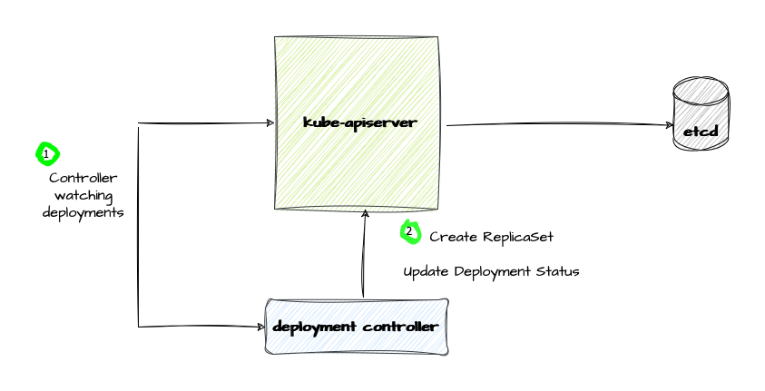
</p>


The ReplicaSet instance created has the ownerReferences field in the metadata section set. This essentially indicates the ReplicaSet is _owned_ by the Deployment instance specified

```yaml
    ownerReferences:
    - apiVersion: apps/v1
      blockOwnerDeletion: true
      controller: true
      kind: Deployment
      name: nginx-deployment
      uid: df02a54a-cf4b-4543-870a-523c2da36bbd
```

3. Kubernetes relies on the [ReplicaSet controller](https://github.com/kubernetes/kubernetes/blob/e67f889edc4ab278028f6cffd2501bc90a0defcf/pkg/controller/replicaset/replica_set.go#L118) to maintain a set number of identical pods for your deployments. The ReplicaSet controller constantly watches the cluster for ReplicaSets.

<p align="center">
  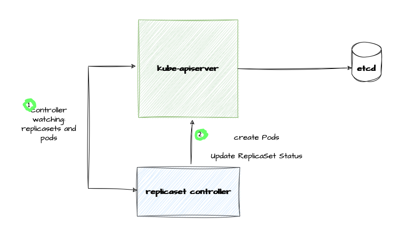
</p>


```
kubectl get pods -n test
NAME                               READY   STATUS    RESTARTS   AGE
nginx-deployment-576c6b7b6-wzc6l   1/1     Running   0          24m
nginx-deployment-576c6b7b6-xwsc2   1/1     Running   0          24m
```

And each Pod instance has the ownerReferences field in the metadata field set. This indicates that these pods are created and managed by a specific ReplicaSet instamce.

```yaml
  ownerReferences:
  - apiVersion: apps/v1
    blockOwnerDeletion: true
    controller: true
    kind: ReplicaSet
    name: nginx-deployment-576c6b7b6
    uid: 9a749240-6b63-4c29-ad7e-ba8dcd9a16bc
```

If a pod is deleted unexpectedly (due to crash or other reasons), the ReplicaSet controller will notice the change. It then springs into action to maintain the desired number of pods. In this case, it would create a new pod to bring the total back to the expected count.

## Creating a Controller

We will use [Kubebuilder](https://github.com/kubernetes-sigs/kubebuilder) to start creating a controller. If you haven't installed Kubebuilder yet, no worries! Head over to the [section](custom-resources.md#kubebuilder) for a quick setup guide.

Run the following command to create a new controller:

```bash
kubebuilder create api --group <GROUP> --version <VERSION> --kind <Kind> --controller --resource=false
```

The controller is created in _internal/controller_ directory:

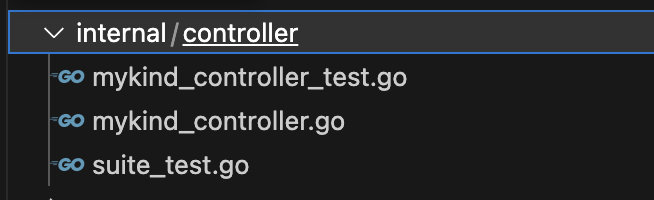

It's important to remember that adding functionality to Kubernetes doesn't always require a new CustomResourceDefinition. One example is this [controller](https://github.com/gianlucam76/claudie-sveltos-integration) I developed. 

This example integrates Claudie (cluster provisioning) and Svel[Sveltos](https://github.com/projectsveltos)tos (cluster management) using a controller that watches Claudie's secrets to automatically manage SveltosClusters. It leverages existing resources for seamless integration.

By creating this controller, I leveraged existing resources and achieved seamless integration between Claudie and Sveltos. This demonstrates the power of controllers in Kubernetes without relying on introducing a new CRD.

As with CustomResourceDefinition, I will use concrete examples taken from open source projects I maintain.

## Example: k8s-cleaner controller

K8s-cleaner controller watches for [Cleaner](https://github.com/gianlucam76/k8s-cleaner/blob/main/api/v1alpha1/cleaner_types.go) resources.

Keep in mind that a resource and its status subresource are distinct [entities](custom-resources.md#status-subresource). This distinction allows us to control access to the Cleaner resource itself and its status independently using RBAC.

Our controller needs two main permissions:

1. Monitoring Changes: To react to updates in the Cleaner's desired state (the Spec), the controller needs permission to _get_, _list_, and _watch_ Cleaner resources.
2. Updating Status: Since the controller manages the actual state (the Status) of the Cleaner, it requires permission to _get_, _update_, and _patch_ the status subresource.

<p align="center">
  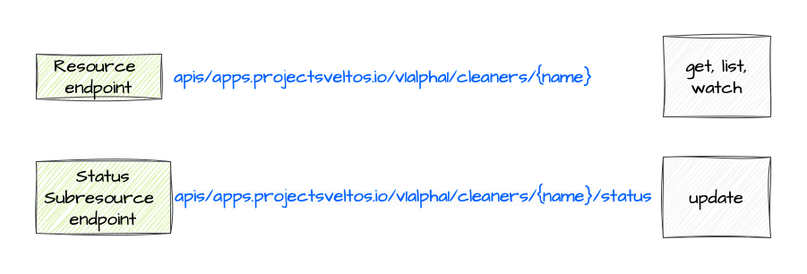
</p>


Kubernetes simplifies defining access control for our Cleaner objects using special `markers`. These markers are indicated by `+kubebuilder:rbac:`.
Here's an example of how to define the necessary permissions:

```go
//+kubebuilder:rbac:groups=apps.projectsveltos.io,resources=cleaners,verbs=get;list;watch
//+kubebuilder:rbac:groups=apps.projectsveltos.io,resources=cleaners/status,verbs=get;update;patch
```

In practice, Cleaner resources require slightly more permissions due to a feature called a [finalizer](#finalizers). Finalizers are a mechanism to prevent objects from being deleted until specific cleanup actions are performed.

Kubernetes doesn't currently expose finalizers as a dedicated API endpoint. An interesting discussion on this topic can be found [here](https://github.com/kubernetes/enhancements/pull/3286). Therefore, Cleaner RBAC definitions typically look like this:

```go
//+kubebuilder:rbac:groups=apps.projectsveltos.io,resources=cleaners,verbs=get;list;watch;patch
//+kubebuilder:rbac:groups=apps.projectsveltos.io,resources=cleaners/status,verbs=get;update;patch
//+kubebuilder:rbac:groups=apps.projectsveltos.io,resources=cleaners/finalizers,verbs=update
```

This grants the previously mentioned permissions along with the ability to patch cleaner objects, enabling the controller to manage the finalizer.
Even though finalizers is not an endpoint, I add a marker here to make it clear Cleaner controller adds/removes finalizer. 

Remeber to run `make manifests` anytime you change those markers.

### SetupWithManager

The first method we need to implement is `SetupWithManager`. Here we say what resource we want to reconcile.

```go
// SetupWithManager sets up the controller with the Manager.
func (r *CleanerReconciler) SetupWithManager(ctx context.Context, mgr ctrl.Manager,
	numOfWorker int, logger logr.Logger) error {

	return ctrl.NewControllerManagedBy(mgr).
		For(&appsv1alpha1.Cleaner{}).
		WithEventFilter(predicate.GenerationChangedPredicate{}).
		WithOptions(controller.Options{
			MaxConcurrentReconciles: r.ConcurrentReconciles,
		}).
		Complete(r)
}
```

<p align="center">
  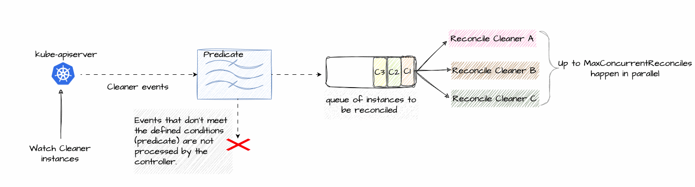
</p>


The Kubernetes [controller-runtime](https://github.com/kubernetes-sigs/controller-runtime) project is a set of go libraries for building controllers. We'll be relying on this library heavily throughout this tutorial.

The code we're looking at defines a new controller specifically for a resource called _Cleaner_. The _MaxConcurrentReconciles_ setting determines the maximum number of concurrent reconciliation processes that can be run at the same time. In other words, it controls how many different Cleaner instances can be handled for reconciliation in parallel.

We can control which events trigger the controller's reconcile loop. The `GenerationChangedPredicate` helps with this by only considering updates where the object's generation field changes. The metadata.generation increases whenever the object's specification (the spec field) is modified.
This means the controller will ignore updates that only affect the object's metadata or status fields, as long as the specification remains unchanged. This is useful because in our case, the user defines the desired state (the spec) and the controller manages the actual state (the status). Reconciling only on spec changes avoids unnecessary processing when the status is simply updated.

There are other pre-defined filters like _AnnotationChangedPredicate_ and _LabelChangedPredicate_ And you can use a combination of them.
For instance

```go
WithPredicates(predicate.Or(predicate.GenerationChangedPredicate{}, predicate.AnnotationChangedPredicate{})).
```

If we did have watchers (like the example [add-on controller](#example-add-on-controller), the predicate added with WithEventFilter would be applied to all those watched resources.

### Reconcile

The second method we are interested in is `Reconcile`. This function springs into action whenever a Cleaner resource is changed, prompting our controller to respond.

```go
func (r *CleanerReconciler) Reconcile(ctx context.Context, req ctrl.Request) (_ ctrl.Result, reterr error) {
```

The _ctrl.Request_ object provides the namespace and name of the Cleaner instance that needs reconciliation. Since Cleaner resources are "cluster-wide", the namespace field will always be empty. This means the unique identifier for a Cleaner is simply its name. So the first thing we do in the Reconcile method is to fetch the resource

```go
cleaner := &appsv1alpha1.Cleaner{}
err := r.Get(ctx, req.NamespacedName, cleaner)
```

You might be wondering "Why not receive the entire Cleaner object directly?" "Why do I just get the namespace,name and have to query it?" This design choice might seem counterintuitive at first, but obviously it is not. When a change event occurs, it adds the event to a queue and subsequently calls the Reconcile function. When the Reconcile function is invoked depends on how many reconciliations are already happening (remember we set `MaxConcurrentReconciles`) or other factors. Even if a change event occurs and the resource is deleted before the Reconcile function is called (due to queueing or other factors), the controller can still function correctly. By querying the current state using the name, it acts based on the actual state at that moment and moves the system towards the desired state, ignoring any intermediate changes.

<p align="center">
  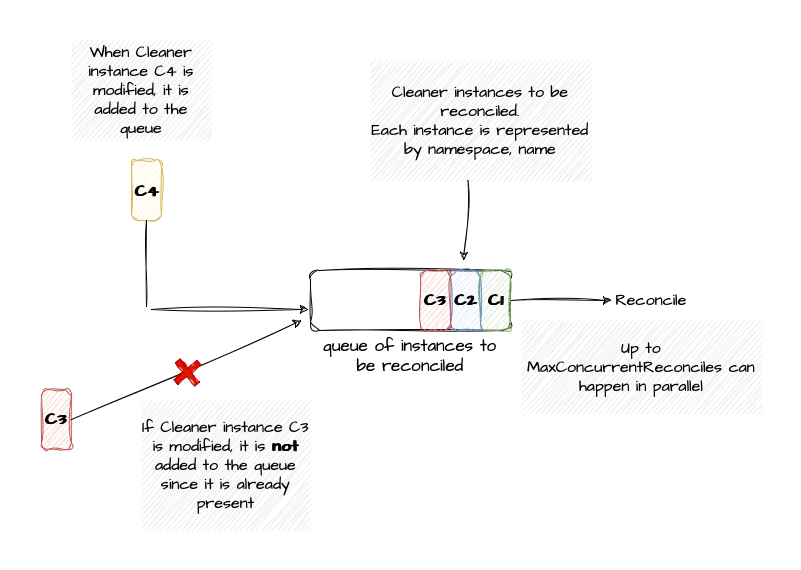
</p>

In other words, quoting the controller-runtime documentation: "Reconciliation is level-based, meaning action isn't driven off changes in individual events, but instead is driven by actual cluster state read from the apiserver or a local cache. For example if responding to a Pod Delete Event, the Request won't contain that a Pod was deleted,
instead the reconcile function observes this when reading the cluster state and seeing the Pod as missing."

Controller must reconcile resources based on the current state, not by the event that triggers the reconciliation.

So when our Reconcile is invoked, resource might be already gone. Handle that in code

```go
	cleaner := &appsv1alpha1.Cleaner{}
	err := r.Get(ctx, req.NamespacedName, cleaner)
	if err != nil {
		if apierrors.IsNotFound(err) {
			return reconcile.Result{}, nil
		}
```

Once the controller retrieves the Cleaner resource using the provided namespace and name, it needs to determine its current state. 
_metadata.deletionTimestamp_ field within the resource's metadata indicates whether the resource has been marked for deletion. If this field has a value, it means the resource is undergoing the deletion process. In simpler terms, the controller checks a specific flag within the resource's metadata to see if it's been scheduled for deletion.

You might be wonder why a deleted resource is still present? Should a resource be removed as soon as we issue a kubectl delete? The answer as always is, it depends. In this case it depends on whether resource has a `finalizer` or not. When you tell Kubernetes to delete an object that has finalizers specified for it, the Kubernetes API marks the object for deletion by populating .metadata.deletionTimestamp, and returns a 202 status code (HTTP "Accepted"). The target object remains in a terminating state while the control plane, or other components, take the actions defined by the finalizers. After these actions are complete, the controller removes the relevant finalizers from the target object. When the metadata.finalizers field is empty, Kubernetes considers the deletion complete and deletes the object.

While Cleaner offers notification options like Slack, Webex, Discord, and Teams, it also provides a more in-depth reporting mechanism. This is achieved through a custom resource definition called a `Report`. A Report, introduced by k8s-cleaner, acts as a detailed record. Each Report instance contains a list of all resources that the Cleaner controller identified as matching a specific Cleaner instance. This allows for a more comprehensive understanding of the cleaning process and the resources affected.

Since the Cleaner controller might create a Report resource (a detailed record) during reconciliation, it takes an extra step to ensure a clean deletion process. This step involves using a "finalizer."

## Finalizers

The previous section explained how the Cleaner controller uses `finalizers` to manage the deletion process. Here's a breakdown of this mechanism in simpler terms:

- *Adding a Finalizer*: When the controller encounters a new Cleaner instance for the first time, it adds a special flag called a "finalizer" to that instance. This flag acts as a signal to Kubernetes that the deletion process shouldn't be immediate.
- *Graceful Deletion*: If you delete the Cleaner instance, it won't be removed right away because of the finalizer. This gives the Cleaner controller a chance to perform some final actions before the instance is completely gone.
- *Cleaning Up*: During this grace period, the controller can perform any necessary cleanup tasks. In the case of the Cleaner controller, this might involve deleting any associated Report resources.
- *Final Removal*: Once the cleanup tasks are finished, the controller removes the finalizer from the Cleaner instance. This signals to Kubernetes that it's safe to proceed with the actual deletion.
Using Finalizers with Other Resources:

<p align="center">
  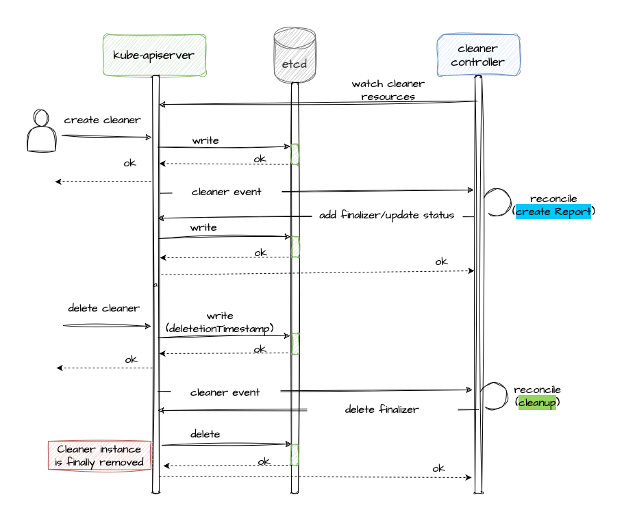
</p>

This concept of finalizers is not specific to Cleaner instances. If your custom controller creates or modifies other resources in Kubernetes, it can also leverage finalizers to ensure a clean and orderly deletion process. Here's the general approach:

- First Reconciliation: When your controller encounters a new resource for the first time, add a finalizer to it.
- Successful Cleanup: Only remove the finalizer when you're confident that all cleanup tasks for the resource have been successfully completed.

By using finalizers, you can ensure that your controller has a chance to perform any necessary housekeeping before resources are removed from the Kubernetes cluster. This helps maintain a clean and consistent state in your environment.

To add a finalizer we use utilities provided by the controller-runtime library.

```go
    CleanerFinalizer = "projectsveltos.io/cleaner-finalizer"

	if controllerutil.ContainsFinalizer(cleaner, appsv1alpha1.CleanerFinalizer) {
		return nil
	}

	controllerutil.AddFinalizer(cleaner, appsv1alpha1.CleanerFinalizer)
```

and to remove finalizer 

```go
    if controllerutil.ContainsFinalizer(cleanerScope.Cleaner, appsv1alpha1.CleanerFinalizer) {
		controllerutil.RemoveFinalizer(cleanerScope.Cleaner, appsv1alpha1.CleanerFinalizer)
	}
```

## Adding in Errors

Reconciliation can encounter errors, such as temporary failures reaching the API server. A retry mechanism is essential.

Let's now delve into the Reconcile method signature to explore the available options for handling these errors.

```go
func (r *CleanerReconciler) Reconcile(ctx context.Context, req ctrl.Request) (_ ctrl.Result, reterr error) {
```

The return value of the Reconcile method dictates how Kubernetes handles the request. Here's a breakdown:

- *Non-nil error*: If the method encounters an error (except for a `TerminalError`), the request is automatically retried with exponential backoff. This ensures the controller keeps attempting to reconcile the resource even if temporary issues arise.
- *Nil error with RequeueAfter*: If no error occurs but `result.RequeueAfter` is set to a specific duration, the request is re-queued after that time has elapsed. This allows for delayed retries in specific scenarios.
- *Nil error with Requeue*: If there's no error and `result.Requeue` is true (without a specific RequeueAfter), the request is re-queued with exponential backoff. This is similar to a non-nil error but might be used for cases where the controller needs to try again after some time, even if no immediate error occurred.

<p align="center">
  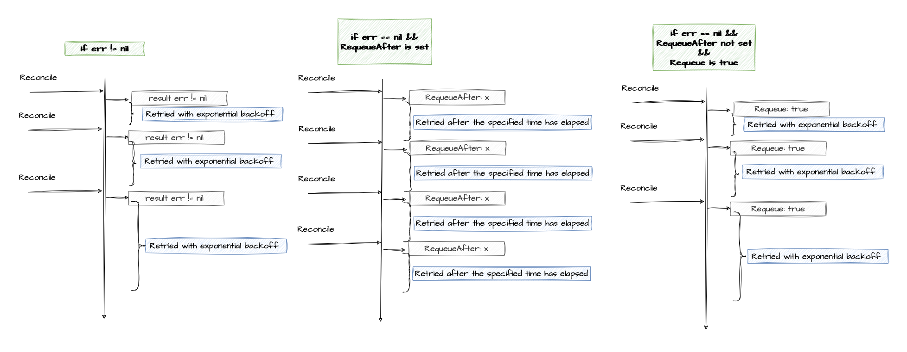
</p>

What I described above is the default behavior. By default when we create a controller, the rate limiter is a token bucket and the per-item is exponential.

The _per-item_ exponential backoff feature is crucial for controller stability. Imagine a scenario where reconciling a specific resource, let's call it Cleaner instance `foo`, keeps failing. With per-item backoff, the delay between retries for `foo` increases exponentially after each failed attempt. This prevents overwhelming the server with continuous retries for the same resource. Here's the key point: the delay for `foo` has no impact on the delay for a completely different resource, like another Cleaner instance `bar`. Each resource has its own independent retry timer that increases based on its own failure history. This ensures that even if one reconciliation keeps failing, it doesn't slow down the processing of other resources handled by the controller.

```go
// DefaultTypedControllerRateLimiter is a no-arg constructor for a default rate limiter for a workqueue.  It has
// both overall and per-item rate limiting.  The overall is a token bucket and the per-item is exponential
func DefaultTypedControllerRateLimiter[T comparable]() TypedRateLimiter[T] {
	return NewTypedMaxOfRateLimiter(
		NewTypedItemExponentialFailureRateLimiter[T](5*time.Millisecond, 1000*time.Second),
		// 10 qps, 100 bucket size.  This is only for retry speed and its only the overall factor (not per item)
		&TypedBucketRateLimiter[T]{Limiter: rate.NewLimiter(rate.Limit(10), 100)},
	)
}
```

While the default settings are suitable for many cases, you can customize the rate limiting behavior for your specific controller. The code snippet shows how to create a controller using `ctrl.NewControllerManagedBy`.  Within the `WithOptions` method, you can provide a custom rate limiter using the `RateLimiter` field. This allows you to define your desired rate limiting strategy instead of using the default one.

```go
	c, err := ctrl.NewControllerManagedBy(mgr).
		For(&configv1alpha1.ClusterProfile{}).
		WithOptions(controller.Options{
			MaxConcurrentReconciles: r.ConcurrentReconciles,
			RateLimiter: <specify yours here>,
		})
```

A Cleaner instance must be reconciled at the scheduled time (`Spec.Schedule`), so RequeueAfter is used. If an error occurs, the error is returned.

```go
ctrl.Result{RequeueAfter: nextRun.Sub(now)}
```

## Example: add-on controller

Sveltos simplifies add-on and application deployment across Kubernetes clusters. It runs within a central management cluster, acting as the control center.
From this central hub, Sveltos can manage add-ons and applications on any cluster it oversees, including the management cluster itself. It offers flexibility by supporting various add-on formats, such as Helm charts, raw YAML, Kustomize, Carvel ytt, and Jsonnet.

Managed clusters are represented in the management cluster as `SveltosCluster` instances. Each ClusterProfile/Profile lists the add-ons and applications to be deployed and selects a subset of the managed cluster using a cluster selector, which essentially functions like a standard Kubernetes label selector.

<p align="center">
  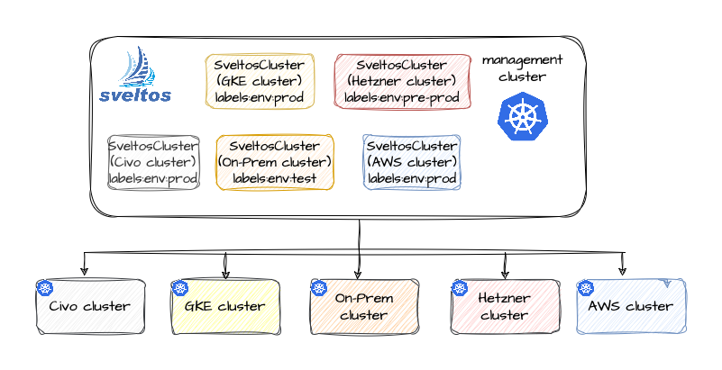
</p>

The ClusterProfile controller reconciles ClusterProfile instances by finding all managed clusters that match a given ClusterProfile instance. 
The `SetupWithManager` method creates a controller for ClusterProfile instances, setting MaxConcurrentReconciles. So far nothing new.

```go
func (r *ClusterProfileReconciler) SetupWithManager(mgr ctrl.Manager) error {
	c, err := ctrl.NewControllerManagedBy(mgr).
		For(&configv1alpha1.ClusterProfile{}).
		WithOptions(controller.Options{
			MaxConcurrentReconciles: r.ConcurrentReconciles,
		}).
```

SveltosCluster instances can be created, updated, or deleted at any time. Additionally, labels associated with these clusters are fully editable. To ensure the ClusterProfile controller can always find matching clusters, it needs to actively monitor and respond to changes in SveltosCluster resources.

The following code snippet demonstrates how the controller achieves this:

```go
		Watches(&libsveltosv1alpha1.SveltosCluster{},
			handler.EnqueueRequestsFromMapFunc(r.requeueClusterProfileForSveltosCluster),
			builder.WithPredicates(
				SveltosClusterPredicates(mgr.GetLogger().WithValues("predicate", "sveltosclusterpredicate")),
			),
		).
```

Let's break down what this code achieves:

1. *Monitoring SveltosCluster Changes*: The code sets up a "watcher" for SveltosCluster resources. This means the controller will be actively notified whenever a SveltosCluster is created, updated, or deleted.
2. *Filtering Events with Predicates (Optional)*: The builder.WithPredicates section allows for defining a "predicate." This is essentially a filter that determines which SveltosCluster events the controller cares about. The specific logic for this filter is defined by the SveltosClusterPredicates function (which we'll explore later). If no predicate is included, the controller will watch all SveltosCluster changes.
3. *Responding to Relevant Events*: When a SveltosCluster event occurs that matches the defined predicate (or all events if no predicate is used), the _requeueClusterProfileForSveltosCluster_ method is called. This method, as we'll see later, identifies which ClusterProfile instances need to be re-evaluated due to the SveltosCluster change.

<p align="center">
  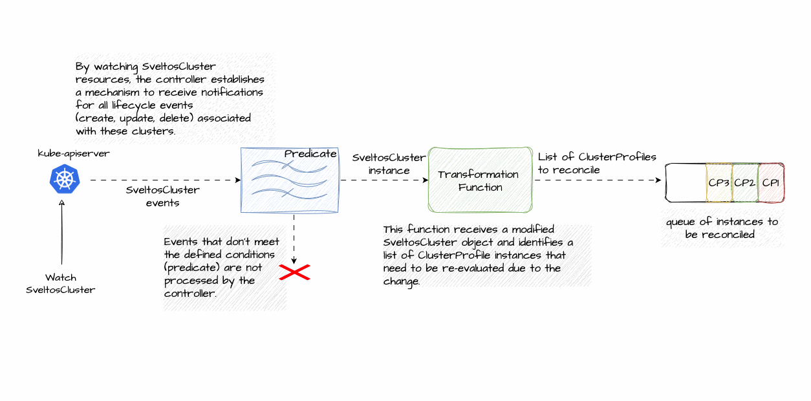
</p>

You can only start a watcher for Kinds that exist in your cluster. And you can watch different resources. For instances, ClusterSummary controller has to react to:

1. SveltosCluster changes
2. ConfigMap changes
3. Secret changes

```go
	c, err := ctrl.NewControllerManagedBy(mgr).
		For(&configv1alpha1.ClusterSummary{}).
		WithOptions(controller.Options{
			MaxConcurrentReconciles: r.ConcurrentReconciles,
		}).
		Watches(&libsveltosv1alpha1.SveltosCluster{},
			handler.EnqueueRequestsFromMapFunc(r.requeueClusterSummaryForSveltosCluster),
			builder.WithPredicates(
				SveltosClusterPredicates(mgr.GetLogger().WithValues("predicate", "sveltosclusterpredicate")),
			),
		).
		Watches(&corev1.ConfigMap{},
			handler.EnqueueRequestsFromMapFunc(r.requeueClusterSummaryForReference),
			builder.WithPredicates(
				ConfigMapPredicates(mgr.GetLogger().WithValues("predicate", "configmappredicate")),
			),
		).
		Watches(&corev1.Secret{},
			handler.EnqueueRequestsFromMapFunc(r.requeueClusterSummaryForReference),
			builder.WithPredicates(
				SecretPredicates(mgr.GetLogger().WithValues("predicate", "secretpredicate")),
			),
		).
		Build(r)
```

### Predicates

Predicates act as filters that determine which events related to a specific resource type are relevant for the controller to handle. This helps to streamline the reconciliation process by focusing only on events that might require the controller's intervention. A Predicate must implement the predicate interface

```go
// TypedPredicate filters events before enqueuing the keys.
type TypedPredicate[T any] interface {
	// Create returns true if the Create event should be processed
	Create(event.TypedCreateEvent[T]) bool

	// Delete returns true if the Delete event should be processed
	Delete(event.TypedDeleteEvent[T]) bool

	// Update returns true if the Update event should be processed
	Update(event.TypedUpdateEvent[T]) bool

	// Generic returns true if the Generic event should be processed
	Generic(event.TypedGenericEvent[T]) bool
}
```

Breaking Down the Methods:

- Create(event.TypedCreateEvent[T]) bool: This method is called when a new resource of type T is created. It should return true if the controller should process the creation event, and false otherwise.
- Delete(event.TypedDeleteEvent[T]) bool: This method is triggered when a resource of type T is deleted. It should return true if the controller needs to react to the deletion, and false otherwise.
- Update(event.TypedUpdateEvent[T]) bool: This method is called whenever an existing resource of type T is updated. It should return true if the update requires controller intervention, and false otherwise.
- Generic(event.TypedGenericEvent[T]) bool: This method provides a generic way to handle any event (create, update, delete) for the resource type T. It's less commonly used and can be left unimplemented if specific handling for each event type (create, update, delete) is sufficient.

The specific logic for filtering SveltosCluster events is defined in the [SveltosClusterPredicate](https://github.com/projectsveltos/addon-controller/blob/7f7677fa9454b83c50215feed745365bad63c99a/controllers/clusterprofile_predicates.go#L139) method.

### Transformation Function

This function takes a modified resource (like a SveltosCluster in our case) and identifies which ClusterProfile instances need to be re-evaluated due to the change.

```go
func (r *ClusterProfileReconciler) requeueClusterProfileForClusterSet(
	ctx context.Context, o client.Object,
) []reconcile.Request {
```

It's crucial to understand that the requeueClusterProfileForClusterSet function (defined in the code snippet above) cannot return errors. This is because errors within the function would result in the event being lost, potentially leading to missed reconciliations.

Let's illustrate this concept with a scenario: a SveltosCluster's labels have been modified. The transformation function goal is to determine which ClusterProfile instances need to be re-evaluated due to this change. There are two categories of potentially affected ClusterProfiles:

- *Previously Matching, Now Mismatched*: These ClusterProfiles used to target the SveltosCluster based on its original labels. However, due to the label change, they no longer match the cluster. These ClusterProfiles might require adjustments to maintain their desired configuration on the cluster.

- *Previously Non-Matching, Now Matching*: These ClusterProfiles did not target the SveltosCluster before the label change. However, with the updated labels, they might now be a match. These ClusterProfiles could potentially apply their configurations to the cluster, introducing new desired states.

By identifying both categories of affected ClusterProfiles, the controller can ensure that the impact of the SveltosCluster change is properly addressed. This ensures that configurations are either maintained (for previously matching profiles) or potentially applied (for newly matching profiles).

A straightforward approach to identify affected ClusterProfiles after a SveltosCluster change might be to directly query for all ClusterProfile instances within the management cluster using the Kubernetes client from the addon-controller. However, this approach has limitations: such query might fail for various reasons. If the query fails, the controller would lose track of the SveltosCluster change event. This could prevent the controller from taking necessary actions to bring the cluster closer to its desired state.
To overcome these challenges, the ClusterProfileReconciler maintains essential information in memory. This includes the ClusterProfiles that previously matched the modified SveltosCluster, along with the cluster selector used by each existing ClusterProfile.

## Conflicts

Every Kubernetes object has a `resourceVersion` field representing the version of that resource as stored in the underlying persistence layer.

In Kubernetes, `optimistic concurrency control` (OCC) is used to manage concurrent updates to resources without explicit locking. Unlike pessimistic locking, which acquires a lock on a resource before modifying it, OCC allows multiple clients to attempt updates simultaneously. Here's how it works:

The Process:

- *Read Resource*: A client retrieves the current state (version) of a resource from the Kubernetes API server.
- *Modify Data*: The client modifies the data locally based on the retrieved version.
- *Submit Update*: The client submits the modified data back to the API server.
- *Conflict Detection*: The API server compares the submitted version with the current version of the resource.

    . *Success*: If the versions match, the update is applied, and the resource version is incremented.

    . *Conflict*: If the versions differ (another client modified the resource in the meantime), the update is rejected. The client receives a conflict error.

<p align="center">
  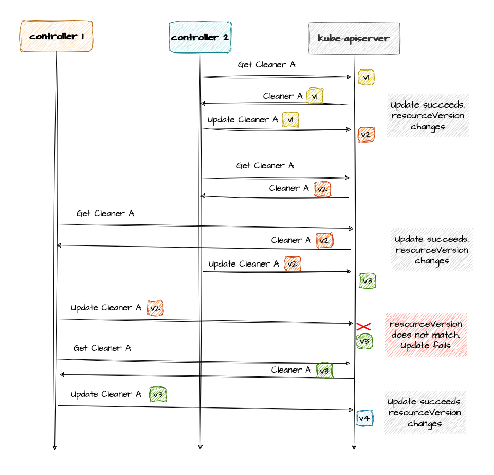
</p>

You need to handle conflicts where the resourceVersion of the object changes between your client reading it and trying to write it back. Kubernetes always detects the conflict, but you as the client author need to implement retries.
You can either simply return the error and as we have seen before this will cause reconciliation to happen again. A common approach is to utilize a `client-go` utility called `RetryOnConflict`. This function wraps your update logic and automatically retries the update in case of a conflict error. Here's an example of how to use RetryOnConflict:

```go
	err = retry.RetryOnConflict(retry.DefaultRetry, func() error {
		clusterReport := &configv1alpha1.ClusterReport{}
		err = c.Get(ctx,
			types.NamespacedName{Namespace: clusterSummary.Spec.ClusterNamespace, Name: clusterReportName}, clusterReport)
		if err != nil {
			return err
		}

		if featureID == configv1alpha1.FeatureResources {
			clusterReport.Status.ResourceReports = resourceReports
		} else if featureID == configv1alpha1.FeatureKustomize {
			clusterReport.Status.KustomizeResourceReports = resourceReports
		}

		return c.Status().Update(ctx, clusterReport)
	})
	return err
```

## Querying List of Resources

When a _Profile_ instance is created or updated, the profile controller actively searches for managed clusters that matches the _clusterSelector_ defined in the profile.
For each successful match between a managed cluster and a profile, the controller creates a corresponding `ClusterSummary` instance. This instance serves as a record, documenting the association between the specific managed cluster and the profile it needs to follow.

When a profile instance is deleted, the controller proactively identifies all ClusterSummary instances that were created due to the now-deleted profile. These ClusterSummary instances are then removed to maintain consistency and avoid clutter in the system.

```go
    listOptions = []client.ListOption{
			client.MatchingLabels{ProfileLabelName: profileScope.Name()},
			client.InNamespace(profileScope.Profile.GetNamespace()),
    },
	
	clusterSummaryList := &configv1alpha1.ClusterSummaryList{}
	if err := c.List(ctx, clusterSummaryList, listOptions...); err != nil {
		return err
	}
```

The provided code snippet effectively filters and retrieves all ClusterSummary instances within the specified namespace that are labeled with the deleted profile's name.

## Log

The controller-runtime `LoggerFrom` returns a logger with predefined values from a context.Context. The logger, when used with controllers, can be expected to contain basic information about the object that's being reconciled like:
- `reconciler group` and `reconciler kind` coming from the For(...) object passed in when building a controller.
- `name` and `namespace` from the reconciliation request.
- `reconcileID` a unique id for each reconciliation

```go
func (r *CleanerReconciler) Reconcile(ctx context.Context, req ctrl.Request) (_ ctrl.Result, reterr error) {
	logger := ctrl.LoggerFrom(ctx)
	logger.Info("Reconciling")
```

For instance

```
{"level":"INFO","time":"2024-06-07T11:56:49.219Z","caller":"controller/cleaner_controller.go:58","message":"Reconciling","controller":"cleaner","controllerGroup":"apps.projectsveltos.io","controllerKind":"Cleaner","Cleaner":{"name":"cleaner-with-report"},"namespace":"","name":"cleaner-with-report","reconcileID":"f122edff-2665-47cd-8590-cc8ebab80f5a"}
```


## Conclusion
 
When developing operators, the controller’s reconciliation loop needs to be idempotent. As seen, the reconciliation loop in an operator controller continuously monitors the state of resources it manages. Events like resource creation, updates, or deletions trigger the loop to analyze the desired state and take necessary actions to bring the actual state of the resource in line with the desired state. The same event (e.g., resource update) might be delivered to the controller multiple times due to network issues, Kubernetes retries, or other reasons. An idempotent reconciliation loop ensures that the controller performs the intended action only once, even with repeated events.
