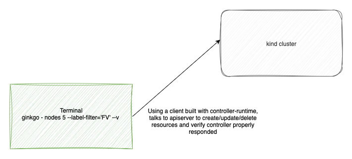
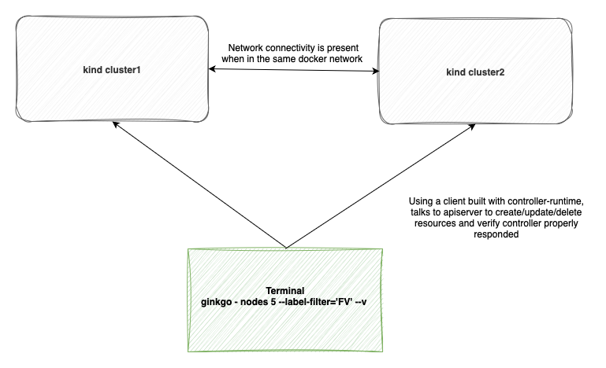

# Testing your controller

Developing a Kubernetes controller involves more than just writing code. A comprehensive testing strategy is essential to ensure your controller is robust, reliable, and secure. While unit tests are a crucial first step, they can't cover every aspect of a controller's behavior, especially its interaction with the Kubernetes API. This is where functional verification comes in.

## The Importance of Functional Verification

`Functional verification`, in the context of a Kubernetes controller, is an integration testing method that validates the controller's behavior within a live Kubernetes environment. This goes beyond checking individual functions in isolation. It verifies that your controller's logic works correctly as part of the broader Kubernetes ecosystem.

Specifically, it helps ensure that:

1. **Reconciliation Works**: The controller's core reconciliation loop correctly observes changes in custom resources (CRs) and takes the appropriate actions on dependent Kubernetes objects.

2. **Finalizers Behave**: The finalizer logic correctly cleans up all associated resources when a custom resource is deleted.

3. **Role-Based Access Control (RBAC) is Correct**: This is a critical point that cannot be fully tested with unit tests. Functional verification allows you to confirm that the service account used by your controller has the necessary permissions to create, update, and delete the resources it needs. An incorrect RBAC configuration can cause your controller to fail in a real cluster.

### How it works

[Kind](https://kind.sigs.k8s.io) is a tool that runs a local Kubernetes cluster using Docker containers as nodes. This approach is lightweight and fast, making it ideal for CI/CD pipelines and local development.

The basic workflow is as follows:

1. **Spin up a Kind cluster**: You create a local, ephemeral Kubernetes cluster with a single command. For example, in the Sveltos `addon-controller` repository, a [configuration file](https://github.com/projectsveltos/addon-controller/blob/main/test/kind-cluster.yaml) defines the cluster's topology (e.g., number of nodes, Pod CIDRs), and a simple Makefile target uses this to create the cluster.

```bash
	sed -e "s/K8S_VERSION/$(K8S_VERSION)/g"  test/$(KIND_CONFIG) > test/$(KIND_CONFIG).tmp
	$(KIND) create cluster --name=$(CONTROL_CLUSTER_NAME) --config test/$(KIND_CONFIG).tmp
```

When you create a Kind cluster, your local __$KUBECONFIG__ file is automatically updated to point to it. This means that any kubectl command you run from your terminal will target this temporary cluster. Similarly, if you're using Go and [controller-runtime](https://github.com/kubernetes-sigs/controller-runtime) to test your controller, a standard call like

```
restConfig := ctrl.GetConfigOrDie()
```

will create a *rest.Config for talking to the Kind apiserver.

2. **Build a Docker image of your controller and load it into the Kind cluster**:  Before deploying your controller, you need to build a Docker image that includes all your latest changes. The image doesn't need to be pushed to an external image registry, which is important for an efficient testing cycle. Instead, you can load it directly into the Kind cluster using a command like [kind load docker-image](https://github.com/projectsveltos/addon-controller/blob/1a1e452e01ed3acd20940d4975758cdcfac27fd8/Makefile#L473).

3. **Deploy your controller and CRDs**: Once the cluster is running, you install your custom controller and its associated Custom Resource Definitions (CRDs). [The example](https://github.com/projectsveltos/addon-controller/blob/1a1e452e01ed3acd20940d4975758cdcfac27fd8/Makefile#L402) from the Sveltos addon-controller repository shows how this is done.

4. **Create a test case, execute the test, and verify the outcome with Ginkgo and Gomega**: The [Ginkgo](https://onsi.github.io/ginkgo/) behavior-driven development (BDD) testing framework and the [Gomega](https://github.com/onsi/gomega) matcher library are the standard tools for writing and executing these tests. They allow you to write expressive and readable test scenarios.

    - **Creating the test case**: You define a test block that outlines a specific scenario, such as creating a custom resource. You use Ginkgo's It and Context functions to structure your tests in a human-readable way.

    - **Executing the test**: Within the test, you use a Kubernetes client to create or modify the custom resources. Your controller, running in the Kind cluster, will pick up these changes asynchronously.

    - **Verifying the outcome**: This is where Gomega shines. Due to the asynchronous nature of Kubernetes controllers, you can't check for the result immediately. Instead, you use Gomega's `Eventually` function to poll the Kind cluster until a certain condition is met or a timeout is reached. This is crucial for verifying that your controller has correctly reconciled the state. For example, you would Eventually assert that a Deployment or other related resource has been created or updated as a result of your controller's actions.

For instance, when a ClusterProfile is created and it matches a managed cluster, the ClusterProfile reconciler inside the addon-controller pod is supposed to:

- create a ClusterSummary instance whose meaning is to deploy those helm charts/Kubernetes resources to the matching cluster
- deploy those resources to the managed cluster.

So the test first creates a ClusterProfile instance:

```go
Byf("Create a ClusterProfile matching Cluster %s/%s",
clusterProfile := getClusterProfile(namePrefix, map[string]string{key: value})
clusterProfile.Spec.SyncMode = configv1beta1.SyncModeContinuous
Expect(k8sClient.Create(context.TODO(), clusterProfile)).To(Succeed())
```

Then verifies the ClusterSummary is created

```go
Byf("Verifying ClusterSummary is created")
Eventually(func() bool {
	clusterSummary, err := getClusterSummary(context.TODO(),
		profileLabelKey, profileName, clusterNamespace, clusterName, clusterType)
	return err == nil && clusterSummary != nil
}, timeout, pollingInterval).Should(BeTrue())
```

Finally, it verifies the resources are deployed to the managed cluster:

```go
Byf("Verifying kyverno deployment is created in the workload cluster")
Eventually(func() error {
	depl := &appsv1.Deployment{}
	return workloadClient.Get(context.TODO(),
		types.NamespacedName{Namespace: "kyverno", Name: "kyverno-admission-controller"}, depl)
}, timeout, pollingInterval).Should(BeNil())
```

If you want to look deeper into this, the [Sveltos addon-controller](https://github.com/projectsveltos/addon-controller/tree/main/test/fv) repository has over thirty functional verification tests that provide good examples. You can find them in the test/fv directory of the project.

<p align="center">
  
</p>

## Multiple clusters

Some advanced controllers, like the Sveltos addon-controller, require more than one cluster to test their functionality. For these scenarios, you can easily create and manage multiple clusters with Kind. The key is to ensure that the pods in different clusters can communicate with each other, which is achieved by placing them on the same Docker network.

Here's a step-by-step process for setting this up:

1. **Create two Kind clusters**: Use `kind create cluster` twice, making sure to use a different name for each cluster. It's also critical that you use different _Pod CIDRs_ for each cluster to prevent IP address conflicts. This ensures that the two clusters have distinct internal networks.

2. **Create a Docker network**: If you don't have one already, create a new Docker network that both clusters can join.

```bash
docker network create my-docker-network
```

3. **Connect the clusters to the network**: Add the control plane node of each Kind cluster to the Docker network you just created. The control plane node acts as the gateway for the cluster's internal network.

```bash
docker network connect my-docker-network cluster1-control-plane
docker network connect my-docker-network cluster2-control-plane
```

After these steps, the pods in cluster1 can access the API server of cluster2 and vice versa, allowing you to test complex, multi-cluster scenarios directly from your local machine.

<p align="center">
  
</p>


Take a look at [Sveltos addon-controller](https://github.com/projectsveltos/addon-controller/blob/1a1e452e01ed3acd20940d4975758cdcfac27fd8/Makefile#L343) example. This approach is used for testing Sveltos pullmode feature.

Sveltos's addon-controller uses also another approach for its multi-cluster testing. It takes advantage of [ClusterAPI](https://github.com/kubernetes-sigs/cluster-api) to simulate a management cluster environment. This is a common pattern in the Kubernetes ecosystem, where one cluster is used to manage the lifecycle of other, "managed" clusters.

Here is the approach Sveltos uses:

1. **Create the Management Cluster**: A single Kind cluster is created to serve as the management cluster.

2. **Deploy Cluster API**: The Cluster API components are then deployed onto this Kind cluster. This turns the Kind cluster into a management hub capable of provisioning and managing other clusters.

3. **Provision the Managed Cluster**: Using Docker as the infrastructure provider for Cluster API, a second, managed cluster is provisioned. This cluster is also a set of containers, but its lifecycle is now managed by the Cluster API instance running on the first Kind cluster.

Here is the [Makefile target](https://github.com/projectsveltos/addon-controller/blob/1a1e452e01ed3acd20940d4975758cdcfac27fd8/Makefile#L271) for it.


## Summary

A robust testing workflow for a Kubernetes controller should include a combination of different testing methodologies. I recommend a multi-stage approach that includes linting, unit tests, and functional verification before any changes are merged.

1. **Linting & Static Analysis**:
Start with tools like _golangci-lint_ to catch simple errors, enforce coding standards, and identify potential bugs early in the development cycle. This is the fastest feedback loop and a simple way to maintain code quality.

2. **Unit Tests**:
Unit tests focus on individual functions and components in isolation. You can mock out the Kubernetes API server and focus on testing the core business logic of your reconciliation functions. This is fast and effective for ensuring the correctness of your code's algorithms and data transformations. For instance the `sigs.k8s.io/controller-runtime/pkg/client/fake` package is a tool for this task. It provides an in-memory client that mimics the behavior of a real Kubernetes API server, allowing you to test your reconciliation logic in isolation.

3. **Functional Verification**:
This is the heart of your integration testing. I've found that using a lightweight, ephemeral cluster like Kind  is the most effective way to perform this step. It provides a real Kubernetes environment without the complexity and resource cost of a full-scale cluster. You can write tests that create, update, and delete your custom resources and then assert that the controller performs the expected actions, all within a real, but contained, cluster. Tools like `Ginkgo` and `Gomega` are great for this, as they provide a BDD-style testing framework that makes it easy to write expressive and readable tests.

4. **End-to-End (E2E) Tests**:
While not always necessary for every minor change, E2E tests are crucial for verifying the full user experience. They are typically run in a more permanent, production-like environment and test the entire system from the user's perspective, for example, by ensuring that a custom resource is applied and the desired outcome is achieved.

